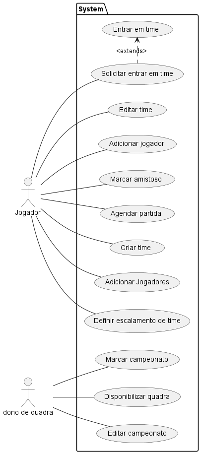

# ES3
## Integrantes
 - André Richard Michael Cardoso (ARMCardoso)
 - Gabriel Alves Rodrigues (GabrielAlves027)
 - Gulherme de Freitas Diniz (guilhermedefreitasdiniz’s)
 - Ítalo Béllo Silva (Lflickr)
 - Kaike Freitas de França (KaikeFF)

## Organização do projeto
Projeto organizado pela plataforam trello
link:
## Resumo do projeto
A ideia de um sistema para tornar espaços esportivos mais atrativos e consequente mais rentáveis passa por gamificar os esportes. O sistema visa que todos os esportistas que desejam locar quadras para praticar esportes, possam fazer isso através dele, agendando horários e realizando pagamentos antecipados. No assunto gamificação, o software trará a possibilidade da criação de times e agendamento de amistosos por parte do esportista, enquanto isso, o dono do estabelecimento poderá criar competições para atrair o público para seu espaço. O sistema contará com uma espécie de ranking, no qual estará no topo o usuário ou time, que mais realizou agendamentos naquele período, este ganhará brindes e benefícios. Além disso, o sistema deverá manter em segurança todos os dados dos usuários.

## Tecnologias utilizadas 
### Front-End
 - HTML5
 - CSS3
 - JavaScript
 - React

### Back-End
 - Node.js
   
### Banco de dados
 - MySQL
   
### Ferramentas
 - MySQL
 - BRmodelo
 - VS Code
 - Figma

## Casos de uso

## DER

## Diagrama de classes

#Listagem

##Tabelas
 - Dono de Quadra
 - Quadras
 - Jogadores
 - Times
 - Jogos
 - - Amistosos
 - - Campeonatos

##Telas
